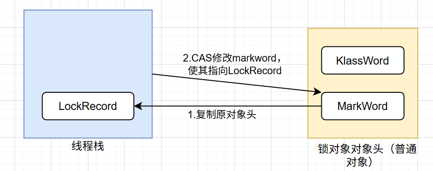

在多个线程访问共享资源的时候，由于分时系统，线程可能发生切换，导致指令没有按照我们预想的顺序执行，从而致使发生错误。例如商场系统中经典的库存超卖问题，就是多线程并发导致的问题。

为了准确描述问题，我们引入两个概念：**临界区** (Critical Section)、**竞态条件**(Race Condition)
- **临界区**：临界区是指**访问共享资源的代码块区域**，并可能被多个线程同时执行
- **竞态条件**：竞态条件是指**多个线程同时在临界区执行，由于执行的顺序未知导致结果不可预测**

要解决并发带来的问题，就是要避免临界区的竞态条件，常用的手段如下
阻塞式方案：synchronized、Lock
非阻塞式方案：原子化操作、乐观锁

本文主要介绍synchronized方案，并介绍synchronized的一些原理，聊一聊不能唠的比磕~

## synchronized 用法
对于想要保护的临界区，我们可以直接用synchronized给这块区域上锁
```java
synchronized(obj) {
	// 临界区
}

synchronized(obj.class) {
	// 临界区
}
```

可以看到上面的示例代码，我们既可以锁对象实例，也可以锁对象的Class对象。我们把它们分别称作：实例锁、类锁
- 实例锁：锁定的是堆中的实例对象
- 类锁：锁定的是方法区中的Class对象

我们也可以直接在方法上加 synchronized 来上锁
```java
public class Example {
	 public synchronized static void t1() {
		 // 临界区
		 // 锁static方法，相当于上类锁
	 } 
	 
	 public synchronized void t2() {
		 // 临界区
		 // 锁非static方法，相当于上实例锁
	 }
}
```

synchronized 采取互斥的方式让**同一时刻只有一个线程可以拿到锁对象**，而只有拿到锁对象的线程才可以执行临界区的代码。这样就可以保证拿到锁的线程可以安全地执行临界区的代码，不用担心线程上下文切换时其它线程执行临界区的代码。
syncrhonized 本质上是**用对象锁保证了临界区中的代码的原子性**，让临界区的代码执行时不可分割，不会被线程切换打断。

## 锁升级 
synchronized 会在遇到不同的情况之后进行锁膨胀，这对开发者是透明的，你只要上锁就行了，synchronized考虑的可就多了 (bushi)。
在JDK15前锁膨胀的路径是：无锁 -> 偏向锁 -> 轻量级锁 -> 重量级锁。因为近年来大多数应用的并发模式中，由偏向锁带来的收益已经小于其维护开销，因此JDK 15决定默认禁用并最终移除了它。JDK15以后移除了偏向锁，所以锁膨胀的路径是：无锁 -> 轻量级锁 -> 重量级锁。本文以JDK15以后的环境为准，介绍轻量级锁和重量级锁
### 对象头
为了更好的介绍轻量级锁的上锁原理，首先我们需要了解以下对象头。对象头是Java对象再内存中的一部分，用于存储该对象的元数据和运行时信息。普通对象头主要由两部分组成：MarkWord和KlassWord，数组对象还要多一个数组长度。如下图：


其中MarkWord的结构为：

可以看到MarkWord中存储了线程上锁的状态，无锁、偏向锁、轻量级锁、重量级锁，这些正是锁膨胀的路径
### 轻量级锁
当第一个线程首次抢到锁，进入synchronized同步块的时候，会变成轻量级锁的状态。JVM会在当前线程创建一个LockRecord的记录空间，这个LockRecord包含两部分：Displaced Mark Word、指向锁对象的引用。Displaced Mark Word会拷贝一份锁对象原来的markword并保存起来，以便以后释放锁的时候恢复。然后线程使用CAS原子操作，尝试将锁对象头中的markword中的 `ptr_to_lock_record` 指针，指向该线程栈帧中LockRecord。
- 如果CAS成功，即当前锁对象的markword仍然是LockRecord之前复制时的状态，那么说明当前没有其它线程竞争，则此时当前线程获得该锁对象的轻量级锁
- 如果CAS失败，那么说当前存在其它线程竞争，此时会进入锁膨胀，这个后面再说
所以加轻量级锁的逻辑如下图：

那么如果发生了锁重入呢？这时JVM会在线程栈创建一个新的LockRecord，但是这个LockRecord的 displaced mark word 会被设置为 null（起到一个计数器的作用），而不是复制对象头中的 mark word，JVM不会对这个新的LockRecord执行CAS去修改锁的对象头。在解锁的时候，线程栈会先解开内部同步块的锁，对应到线程栈中就是先弹出 LockRecord中 displaced mark word 为 null 的 LockRecord，这样就实现了可重入锁。
回到之前的线程竞争问题，如果CAS失败，那么说明当前线程存在竞争，此时当前线程会进入自旋，也可以说是忙等待，也就是不断尝试获取锁，如果自旋期间锁被释放了，那么就可能抢到锁，否则如果自旋期间没有抢到锁，就会进行锁膨胀，升级为重量级锁。
所以我们可以发现，轻量级锁只适应无线程竞争或者少量线程竞争的场景，一旦面临多线程竞争时，就需要用到重量级锁
### 重量级锁
对于每一个锁对象都会关联一个Monitor，这个Monitor就是真正的“锁”，Monitor的结构如下：

可以看到Monitor中有Owner、EntryList、WaitSet，整个重量级锁就是由这三个字段给管理起来的。当轻量级锁膨胀升级为重量级锁时，原先持有锁的线程就会让owner指向该线程，而竞争失败的线程会进入EntryList，进入阻塞状态，等待锁释放后被唤醒。
waitset是waiting状态线程呆的地方，比如在线程中调用了obj.wait()就会进入waiting状态，如果再被notify给叫醒就会重新与其它线程进行竞争。
这时发生线程竞争和锁重入就很好办了。首先对于锁重入，Monitor中有个锁计数器，在第一次获取锁的时候，线程会基于CAS将owner指向当前线程，并将锁计数器加一，而在第二次时，如果发现目前要获取的锁已经是当前持有的锁时，就直接不执行CAS操作，直接将锁计数器加一就行。在后面退出锁的时候将技术器减一，直到计数器为1时，把计数器减为0然后置owner为null。
那么如果发生线程竞争，如果当前竞争锁的线程发现，目前的owner已经指向其它线程了，那么与轻量级锁近似，竞争失败的线程在进入EntryList之前，会有一个短暂的自旋优化尝试。这个自旋操作是为了在所可能很快释放的情况下，避免线程阻塞和唤醒的成本。

## synchronized 的秘密
> 可以和你一起竞争锁这件事已经很带派了

当你写下 `synchronized(obj)`这一行代码时，就像是与 JVM 立下了一个默契的约定。JVM 则在背后默默地为你上演着一出出锁升级、自旋、排队、唤醒的精彩大戏。所以，下次当你使用它时，或许可以会心一笑，想起这一切背后的精妙设计。